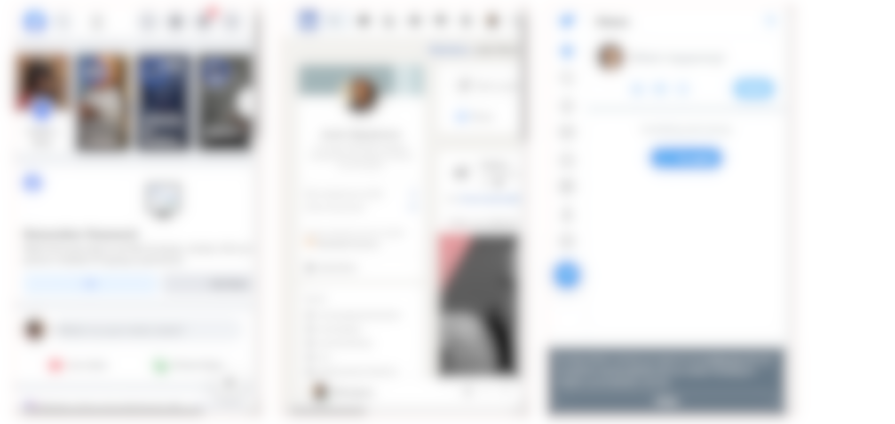

## Iframe enabled News Portal

Open index.html in web browser

### Disable X-Frame-Headers

Go to [https://chrome.google.com/webstore/detail/ignore-x-frame-headers/gleekbfjekiniecknbkamfmkohkpodhe?hl=en](https://chrome.google.com/webstore/detail/ignore-x-frame-headers/gleekbfjekiniecknbkamfmkohkpodhe?hl=en) and enable the chrome extension Ignore X-Frame headers

Go to [https://app.requestly.io/rules](https://app.requestly.io/rules) and create rules for X-Frame-Options for:

- facebook.com

- linkedin.com

- twitter.com

